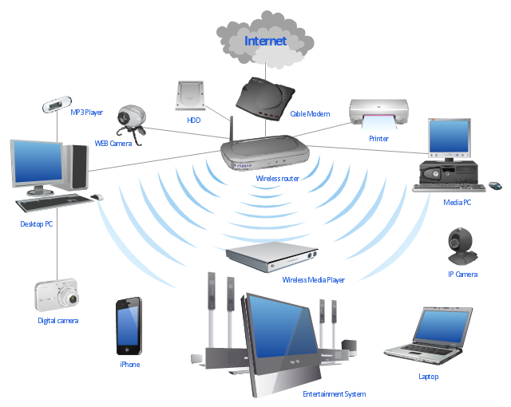
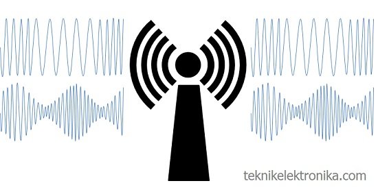
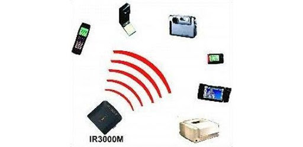
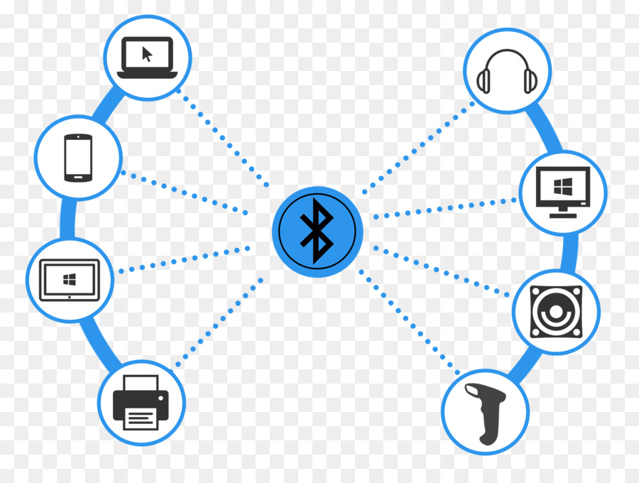
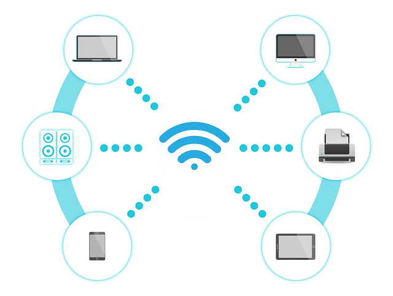

### Media Jaringan Nirkabel

## Sinyal RF(Radio Frequency)

sinyal radio frekuensi merambat melalui udara sinyal tersebut akan kehilangan amplitudonya apabila jarak antara pengirim dan penerima bertambah yang berakibat amplitue sinyal menurun secara eksponesial. sinyal harus memiliki cukup energi untuk mencapai jarak di mana resiver berada
Radio sering di gunakan pada pengendali jarak jauh tanpa kabel atau sering di sebut dengan (remote control) bisanya digunakan pada radio televisi ht dan dan lain lain. 
radio(RF) mempunyai frekuensi sinyal yaitu 300Mhz sampai 3 Ghz(3.000 Mhz)ketika ada halangan yang menghalangi sinyal tersebut maka sintal tersebut tidak akan terganggu dan juga Rf tidak akann interface oleh sinyal lainnya

# contoh media pengunaan Sinyal Radio RF (Radio Frequency)
- Telephone
- Radio
- Televisi

## Sinyal Infared

Infrared adalah radiasi elektromagnetik dari panjang gelombang lebih panjang lebih panjang dari cahaya tampak, tetapi lebih pendek dari radiasi gelombang radio karakteristik 
- tidak dapat di lihat oleh manusia 

# Jenis Panjang gelombang infrared
- Inframerah jarak dekat dengan panjang gelombang 0.75 – 1.5 µm
- Inframerah jarak menengah dengan panjang gelombang 1.50 – 10 µm
- Inframerah jarak jauh dengan panjang gelombang 10 – 100 µm

### Bluetooth

adalah spesifikasi industri untuk jaringan kawasan pribadi (personal area networks atau PAN)tanpa kabel. bluetooth beroprasi dalam  pita frekuensi 2,4 GHz dengan menggunakan sebuah frequency hopping traceiver yang mampu menediakan layanan telekomukani data secara real time

Frekuensi	ISM band, 2400 - 2483.5 MHz (mayoritas), untuk beberapa negara mempunyai batasan frekuensi sendiri, spasi kanal 1 MHz.
Maksimum Output Power	Power class 1: 100 mW (20 dBm)Power class 2: 2.5 mW (4 dBm)Power class 3: 1 mW (0 dBm)
Modulasi	GFSK (Gaussian Frequency Shift Keying), Bandwidth Time: 0,5; Modulation Index: 0.28 sampai dengan 0.35.
Out of band Spurious Emission	30 MHz - 1 GHz: -36 dBm (operation mode), -57 dBm (idle mode)1 GHz – 12.75 GHz: -30 dBm (operation mode), -47 dBm (idle mode)1.8 GHz – 1.9 GHz: -47 dBm (operation mode), -47 dBm (idle mode)5.15 GHz –5.3 GHz: -47 dBm (operation mode), -47 dBm (idle mode)
Receiver	
Actual Sensitivity Level	-70 dBm pada BER 0,1%.
Spurious Emission	30 MHz - 1 GHz: -57 dBm1 GHz – 12.75 GHz: -47 dBm
Max. usable level	-20 dBm, BER: 0,1%
jarak jaringan bluetooth biasanya -+10m

## Jaringan Wi-Fi

Wi-Fi adalah singkatan dari “Wireless Fidelity” sebuah teknologi yang memanfaatkan peralatan elektronik untuk bertukar data (mengunakan gelombang radio). teknologi wifi merupakan teknologi yang berbasis pada standar IEEE 802.11Karena kemampuannya yang memperbolehkan Jaringan Area Lokal (Local Area Network atau LAN) untuk beroperasi tanpa memerlukan kabel (nirkabel),Wifi memiliki frekuensi  2.4 GHz dan 5 GHz 
-  IEEE 802.11b 2,4 Ghz memiliki rate sebesar 1 Mbps sampai 11 Mbps jarak 350 ft atau 105 meter
-  IEEE 802.11g 2,5 GHz memiliki rate sebesar 6 Mbps Sampai 54 Mbps jarak 300 ft atau 90 meter
-  IEEE 802.11a 5 Ghz memiliki rate 6 Mbps Sampai 54 Mbps jarak 60 Meter hanya dapat 6 Mbps sedangkan  54Mbps dengan jangkauan kurang lebih 22 meter

### Encoding
encoding penyandian atau proses untuk mengubah sinyal asal ke dalam bentuk yang lebih optimal untuk keperluan komunikasi data Decoding mengekstrak data yang telah di encoding tadi ke dalam bentuk sinyal asli atau asalnya.
sebagai contoh mengubah sinyal bit deret menjadi sinyal bit data jajar.
 

